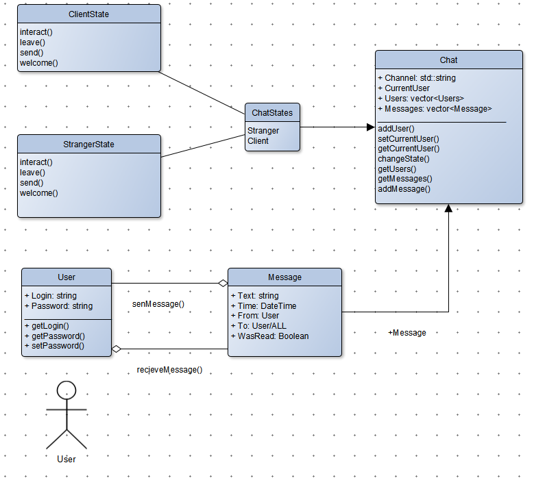

# sf-project1
 - Console chat

- using [State pattern](https://refactoring.guru/ru/design-patterns/state)

- login@password for testing demo@demo
- исходники в utf-8.  Но под win10 в cmd.exe с кодировкой было все ок. 
- type /help to view chat commands

|Команда|Описание|
|--------------|---|
| `/register `      | - зарегистрировать новый аккаунт
| `/login`          | - авторизоваться с существующим аккаунтом (тестовый: **demo@demo**)
| `/help`           | - показать помощь
| `/exit`, `/logout`| - покинуть чат чат
| `@username`       | - личное сообщение пользователю `username`
| `/inbox`          | - показать все сообщения чата
| `/personal`       | - показать все личные сообщения
| `/users`          |- показать список пользователей

